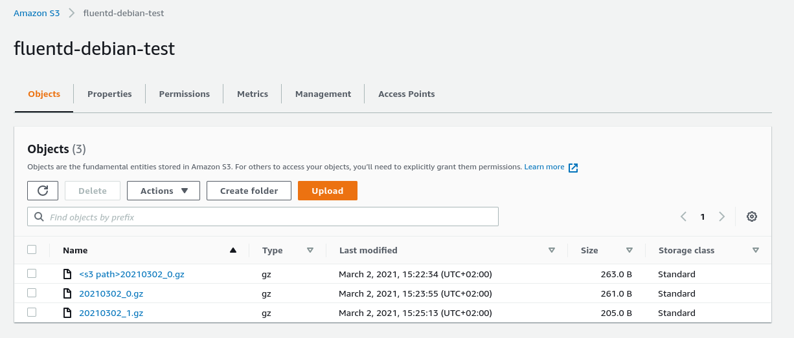

# Collect Rsyslog to S3 with Fluentd

create debian machines:   
1. fluentd

For this install we will use **debian 10.8**   

### Before install - modify ulimit
https://docs.fluentd.org/installation/before-install   

modify ulimit, edit   
```/etc/security/limits.conf```   
add to the file:   
```conf
root soft nofile 65536
root hard nofile 65536
* soft nofile 65536
* hard nofile 65536
```   
reboot   
```systemctl reboot```   

Install netstat if you want to check traffic   
```apt install net-tools```   

### Before install - create IAM user
1. create a new IAM user with permmisions ONLY to the specific bucket     
2. you can use example policy to attach to that IAM user with full permissions ONLY to the specific bucket   
[backet policy](bucket_policy.json)   

### Install ruby
```apt-get install ruby-full```   
check ruby version   
```ruby -v```   
install development tools   
```apt-get install build-essential```   

### Install awscli
```apt-get install python3-pip```   
```pip3 install awscli```   
add your IAM user creds   
```aws configure```   

### Install fluentd
install fluentd   
```gem install fluentd```   
create the configuration file   
```fluentd --setup /etc/fluent```   
edit conf file (sample file here)   
```vi /etc/fluent/fluent.conf```   
[fluent.conf](fluent.conf)   

### Send log messages to Fluentd
edit   
```vi /etc/rsyslog.conf```   
add   
```*.* @127.0.0.1:5140```   
restart rsyslog   
```systemctl start rsyslog```   
check status   
```systemctl status rsyslog```   

### start fluentd
start fluentd   
```fluentd -c fluentd.conf```   

check S3 for the uploaded rsyslog   
   
