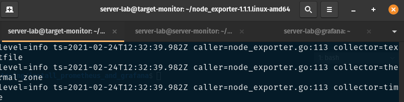
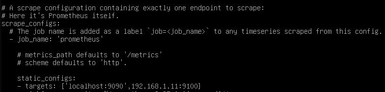
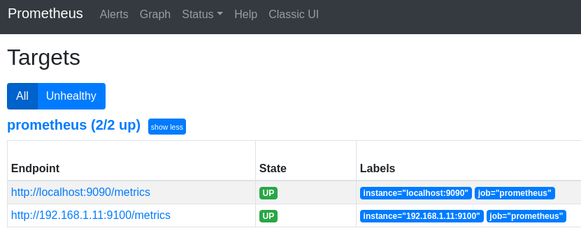
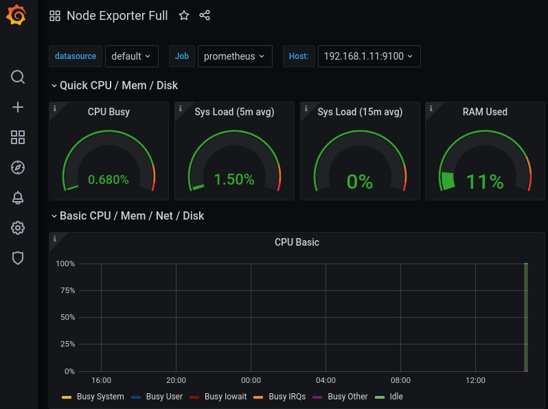

# Install Prometheus and Grafana   

### Setup servers   
Create 3 servers (in this post we will use debian 10.8)   
1. monitor-server   
2. monitor-target   
3. monitor-dashboard   

  

### monitor server   
Install prometheus   
```wget https://github.com/prometheus/prometheus/releases/download/v2.25.0/prometheus-2.25.0.linux-amd64.tar.gz```   

Extract files   
```tar xvfz prometheus-*.tar.gz```   
```cd prometheus-*```   

Start the prometheus server to verify installation and exit   
```./prometheus```   

Check the prometheus dashboard, go to the monitor server's IP and add port 9090   
Example: ```192.168.1.12:9090```   

Configuring Prometheus   
Edit ```prometheus.yml``` with the monitor target   

  


Start with the config file   
```./prometheus --config.file=prometheus.yml```   

Install netstat if you want to check traffic      
```apt install net-tools```   

### monitor target   
Installing and running the Node Exporter   
```get https://github.com/prometheus/node_exporter/releases/download/v1.1.1/node_exporter-1.1.1.linux-amd64.tar.gz```   

Extract files   
```tar xvfz node_exporter-*.*-amd64.tar.gz```   
```cd node_exporter-*.*-amd64```   

Run Node Exporter to start collecting metrics   
```./node_exporter```   

Now the node_exporter is running on port 9100, check the console for message:   
**caller=node_exporter.go:195 msg="Listening on" address=:9100**    

Edit the ```prometheus.yml``` with the target's IP and port, in this case ```192.168.1.11:9100```     

Start the prometheus with new config   
```./prometheus --config.file=prometheus.yml```   

In the prometheus dashboard go to **status** > **targets** to check the new added target   

   

### monitor dashboard (grafana)
Install Grafana, change to root ```su```   
```apt-get install -y adduser libfontconfig1```   
```wget https://dl.grafana.com/oss/release/grafana_7.4.2_amd64.deb```   
```apt install ./grafana_7.4.2_amd64.deb```   

Configuration file location   
 ```/etc/grafana/grafana.ini```   

Start Grafana server   
```systemctl start grafana-server```   
```systemctl status grafana-server```   

Check Grafana dashboard
Example: ```192.168.1.14:3000```   

Default user and password
```admin```   
```admin```   

In grafana dashboard go to **data sources** and add **prometheus**   
Add at the **HTTP** - **URL** the address of prometheus, in my case its: ```http://192.168.1.12:9090```   
Click **save & test**   

Create dashboard in grafana   
click **+** icon and choose **import**   
type into **1860** the field **Import via grafana.com**   
you can find more dashboard to import at: https://grafana.com/grafana/dashboards   
finally click **Load**   

Go to the dashboard home page and choose **Node Expoerter Full** under **Recently viewed dashboards** at the bottom of the page.

   